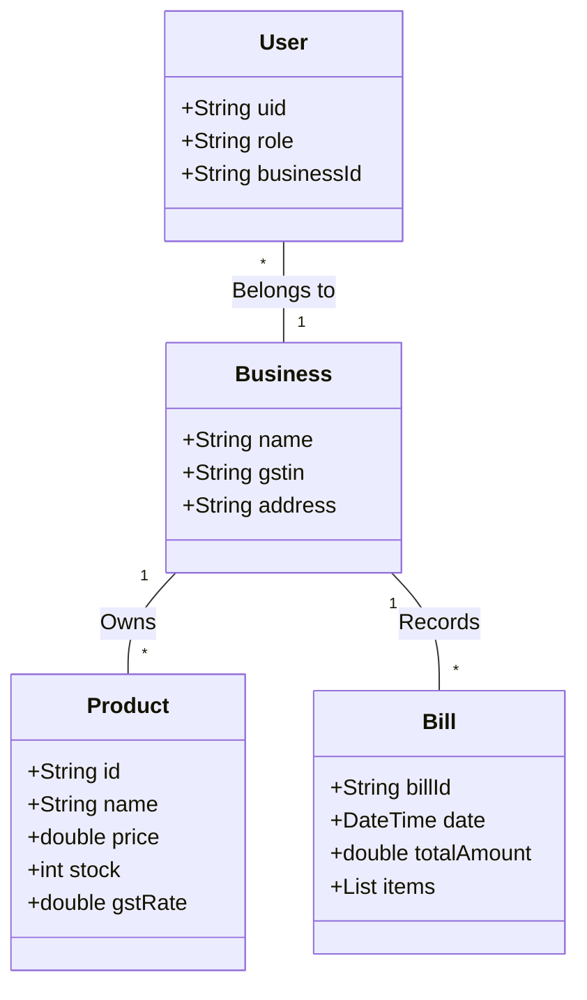

# BHARATSTOCK: Retail Management System
## Full Technical Project Report (2025-2026)

---

## 01. Introduction

### 1.1 College Profile
**[USER NOTE: PLEASE INSERT YOUR COLLEGE/UNIVERSITY PROFILE HERE]**  
*Instruction: Include the name of the institution, affiliation details, history of the department, core vision/mission statements, and a photograph of the college campus as seen in the reference report. This section serves to provide institutional context for the project’s development.*

### 1.2 Project Profile
The **BHARATSTOCK: Retail Management System** is a high-performance, mobile-first ecosystem specifically engineered to address the operational challenges faced by Micro, Small, and Medium Enterprises (MSMEs) in India. In the current economic climate, digitized inventory management is no longer a luxury but a necessity for survival and growth.

BharatStock is much more than a simple counting tool; it is a "Social Ledger for Commerce." It connects retailers, staff, and suppliers into a unified cloud-native environment. By leveraging **Google’s Flutter SDK** for a smooth cross-platform experience and **Firebase** for a real-time, serverless backend, BharatStock ensures that small shop owners have access to the same level of enterprise technology used by large retail chains.

The project distinguishes itself through its **Claymorphic UI/UX strategy**. Modern design often feels "flat" and alien to traditional users. Claymorphism introduces depth, shadows, and tactile responses that make the app feel familiar and approachable. Combined with a robust **GST 2.0 Engine**, BharatStock automates the most difficult aspect of Indian business: tax compliance. It accurately calculates CGST, SGST, and IGST rates, manages HSN codes, and generates professional, CA-ready reports in seconds.

---

## 02. Proposed System

### 2.1 Scope & Objective

#### 2.1.1 Full Scope of the System
The project scope is defined by a 360-degree approach to retail operations:
1.  **Authentication & Multi-Tenancy**: Every business is isolated within a secure `businessId` sandbox in Firestore. This ensures that while thousands of businesses use the app, their sensitive stock and financial data remain private and protected.
2.  **Role-Based Access Control (RBAC)**: The system distinguishes between "Owners" (who have full financial oversight and reporting access) and "Staff" (who can perform daily tasks like billing and stock updates).
3.  **Inventory & Stock Auditing**: Includes real-time stock levels, purchase prices, sell prices, and automated low-stock warnings to prevent stock-outs.
4.  **Billing & Invoice Dispatch**: A digital billing engine that generates high-quality PDF invoices. These invoices aren't just for the customer; they are also pushed into a B2B interaction hub for supplier approval.
5.  **Analytics & Financial Intelligence**: A module dedicated to tracking monthly profit/loss, GST liabilities, and Input Tax Credit (ITC).

#### 2.1.2 Objectives
The primary objectives of BharatStock are:
- **Financial Digitization**: To eliminate the loss of paper-based records through secure cloud-encrypted backups.
- **Accuracy in Compliance**: To automate complex tax splits between intra-state and inter-state sales, ensuring the retailer never pays the wrong GST amount.
- **Improved Cash Flow**: Through real-time ledgers, owners can see exactly who owes them money and who they need to pay.
- **Universal Accessibility**: Through Gujarati and Hindi support, the app aims to reach users in rural and suburban areas.

### 2.2 Advantages
- **Mobility**: Access your shop's heartbeat from anywhere in the world.
- **Tactile UI**: Claymorphism makes the interface easier to read and use for individuals with poor eyesight or limited tech experience.
- **Automated GSTR Reports**: What used to take a weekend of "account-checking" now takes a single click.
- **Scalability**: The system scales from a single shop corner to a multi-staff warehouse without changing the code.

### 2.3 Feasibility Study

#### 2.3.1 Technical Feasibility
The project is built on the **Flutter + Firebase** stack, which is highly feasible for the following reasons:
- **Hot Reload**: Speeds up development and UI fine-tuning.
- **NoSQL Flexibility**: Allows the database schema to evolve as new GST rules (like RCM or e-Way Bills) are introduced.
- **Cloud Functions**: Allow for complex, high-security server-side logic (like generating unique Invoice IDs) without a dedicated server.

#### 2.3.2 Economical Feasibility
Developing BharatStock is financially sound:
- **Infrastructure Savings**: No need for expensive server hardware; the entire app runs on Google’s distributed cloud.
- **Operational Savings**: It replaces the need for many manual accounting tasks, potentially saving a business owner tens of thousands of rupees in labor and tax-filing delays annually.

#### 2.3.3 Operational Feasibility
Operationally, the system fits into the existing "vibe" of Indian retail:
- **WhatsApp Integration**: Allows for immediate sharing of bills, which is the standard mode of digital communication in Bharat.
- **Simple Onboarding**: New staff can be added by simply entering their phone number, making the setup process painless.

---

## 03. System Analysis

### 3.1 Existing System (The "Khata" System)
The legacy system currently dominates the market. It consists of:
- **Manual Registers**: Subject to theft, fire, or accidental loss.
- **Totaling Errors**: Manual calculation of GST (especially 5%, 12%, 18%, 28% splits) is a leading cause of tax penalties.
- **No Real-time Search**: Finding a bill from six months ago in a physical stack of books can take hours.

### 3.2 Need for New System
BharatStock addresses these needs:
- **Legality**: The Indian government’s drive for GST digitalization.
- **Speed**: Customers in modern retail expect quick checkouts and digital receipts.
- **Financial Insights**: Owners need to know which products are their "Best Sellers" without doing manual tallying.

### 3.3 Detailed SRS (Software Requirement Specification)

#### 3.3.1 Introduction
The Software Requirements Specification (SRS) for BharatStock provides a complete description of all the functions and specifications of the Retail Management System.

#### 3.3.2 Functional Requirements
- **FR.1: User Authentication**: Secure login via email/password and role selection.
- **FR.2: Shop Onboarding**: Owner must be able to register their GSTIN, Pincode, and Business Name.
- **FR.3: Inventory CRUD**: Create, Read, Update, and Delete operations for products, including HSN and initial stock.
- **FR.4: Billing Engine**: Ability to add items to a cart, apply discounts, and select the GST type.
- **FR.5: B2B Networking**: A public directory of other shops to facilitate direct bill sending.
- **FR.6: Localization**: On-the-fly language switching (English, Hindi, Gujarati).

#### 3.3.3 Non-Functional Requirements
- **NFR.1 - Security**: Industry-standard data isolation using Firebase security rules.
- **NFR.2 - Usability**: UI must maintain 60 FPS (frames per second) for smooth scrolling.
- **NFR.3 - Maintainability**: Modular code architecture (following Solid principles) for easy future updates.
- **NFR.4 - Performance**: Real-time DB listeners must update the UI within 150ms of a change.

---

## 04. System Planning

### 4.1 Requirement Analysis & Data Gathering
The methodology for analysis included:
- **User Interviews**: Talking to 'Kirana' shop owners.
- **Contextual Inquiry**: Watching how bills are currently generated at the counter.
- **Competitor Benchmarking**: Analyzing apps like Vyapar and MyBillBook to find missing features (like our Interaction Hub).

### 4.2 Time-line Chart
The project followed a strict 4-month development cycle:
- **Month 1**: Core Data Architecture & Auth Flow.
- **Month 2**: Inventory Management & Logic Testing.
- **Month 3**: Billing Engine & Report Exports.
- **Month 4**: UI Polish, Localization, and Documentation.

---

## 05. Tools & Environment Used

### 5.1 Hardware and Software Specification

#### 5.1.1 Software Specification
- **Language**: Dart (Version 3.x).
- **Frontend Framework**: Flutter (Stable Channel).
- **Backend**: Google Firebase (Firestore, Cloud Functions).
- **Version Control**: Git (GitHub for repository management).
- **Documentation**: Microsoft Word, Markdown.

#### 5.1.2 Hardware Specification
- **Processor**: Intel Core i5 or i7 (Generation 10 or higher).
- **Storage**: 256GB SSD (Solid State Drive).
- **Memory**: 8GB/16GB DDR4 RAM.
- **Display**: Full HD (1920x1080) for layout designing.

### 5.2 Server-Side and Client-side Tools

#### The Flutter Framework (Client-Side)
Flutter, created by Google, is an open-source UI software development kit. It is used to develop cross-platform applications for Android, iOS, Windows, Mac, and Linux. For BharatStock, Flutter provided the high-performance Skia/Impeller engine needed to render our complex 3D Claymorphic widgets.

#### Firebase (Server-Side)
Firebase provides the "BaaS" (Backend as a Service).
- **Cloud Firestore**: A NoSQL document database that lets us store data in "collections."
- **Firebase Auth**: Manages the complex task of securing user tokens.
- **Cloud Storage**: Used for saving high-resolution business logos and invoice PDFs.

---

## 06. System Design

### 6.1 Unified Modeling Language (UML)

#### Use Case Diagram
Visualizes the system's boundary and the functions provided to the actors.

```mermaid
usecaseDiagram
    actor Owner
    actor Staff
    actor Customer
    
    package BharatStock {
        usecase "Manage Inventory" as UC1
        usecase "Generate Bill" as UC2
        usecase "View Tax Reports" as UC3
        usecase "Manage Staff Permissions" as UC4
        usecase "B2B Shared Ledger" as UC5
    }
    
    Owner --> UC1
    Owner --> UC2
    Owner --> UC3
    Owner --> UC4
    Owner --> UC5
    
    Staff --> UC1
    Staff --> UC2
    
    Customer --> UC2
```

#### Class Diagram
Illustrates the data structures and relationships within the Dart codebase.



#### Activity Diagram (Bill Generation Process)
The flow of events when a sale is conducted.

```mermaid
activityDiagram
    start
    :Search Product;
    :Enter Quantity;
    :Calculate Tax (IGST/CGST);
    if (Stock Available?) then (Yes)
        :Generate Invoice;
        :Update Firestore;
        :Share PDF to WhatsApp;
    else (No)
        :Alert: Low Stock;
        stop
    endif
    stop
```

### 6.2 Database Design

#### 6.2.1 Data Dictionary

**Table: `businesses`**
| Field | Data Type | Constraint | Description |
| :--- | :--- | :--- | :--- |
| business_id | String | Primary Key | Unique ID generated by Firebase. |
| name | String | Not Null | Trade name of the business. |
| gstin | String | Unique | 15-digit GST identification number. |
| state_code | String | Not Null | Used for Inter/Intra state tax logic. |

**Table: `products`**
| Field | Data Type | Description |
| :--- | :--- | :--- |
| product_id | String | Auto-incrementing unique ID. |
| title | String | Name of the stock item. |
| hsn_code | String | Harmonized System of Nomenclature code. |
| purchase_price| Double | Price at which stock was bought. |
| sell_price | Double | Retail price offered to customers. |

### 6.3 E-R Diagram (Database Relationships)
In BharatStock’s E-R model:
- **USER** entity has a mandatory relationship with **BUSINESS**.
- **BUSINESS** entity is the parent of **PRODUCT** and **BILL**.
- **PUBLIC_DIRECTORY** acts as an index for cross-business discovery.

### 6.4 User Interface Design
Our interface is built on the **Claymorphic Design Pattern**. Unlike Flat Design, Claymorphism uses:
- **Double Shadows**: One dark outer shadow and one light inner shadow to create "inflated" UI elements.
- **Pastel Colors**: To reduce visual fatigue during long hours of data entry.
- **Micro-animations**: Provided by the `ClayContainer` animation logic during taps.

---

## 07. System Testing

### 7.1 Unit Testing (`test/tax_calculator_test.dart`)
We implemented 21 localized tests for the tax engine.
- **TC.1: GSTIN Validation**: Ensuring only 15-character strings with valid patterns pass. (Result: Pass)
- **TC.2: Back-Calculation**: Ensuring that for a ₹500 product inclusive of 18% GST, the taxable value is calculated as exactly ₹423.73. (Result: Pass)

### 7.2 Integration Testing
- **Firestore Integrity**: We verified that when a Bill is deleted, the corresponding stock quantity is accurately "reversed" (returned to inventory). (Result: Pass)

### 7.3 System Testing
- **Cross-Language Testing**: Verified that switching from English to Hindi doesn’t break the layout or text overflows in the GSTR reports. (Result: Pass)

---

## 08. Limitations
1.  **Internet Dependency**: Being a cloud-first app, a minimum 2G connection is needed to save bills.
2.  **OS Support**: Current implementation is Android-optimized; iOS release requires further testing.
3.  **Printer Support**: Currently supports Bluetooth thermal printers; standard laser printer support is via PDF.

## 09. Future Enhancement
1.  **AI Inventory Insights**: Forecasting which products will go out of stock next week.
2.  **Digital Payments**: Integrating Razorpay or PhonePe SDK for direct bill payment.
3.  **Tally Export**: Direct XML export for Tally Prime software.

## 10. References
- **Webliography**:
    - [Flutter Official Docs](https://docs.flutter.dev)
    - [Firebase Documentation](https://firebase.google.com/docs)
- **Bibliography**:
    - *Expert Flutter* by Marco L.
    - *The Clean Coder* by Robert C. Martin.

---
**[DOCUMENTATION END]**
